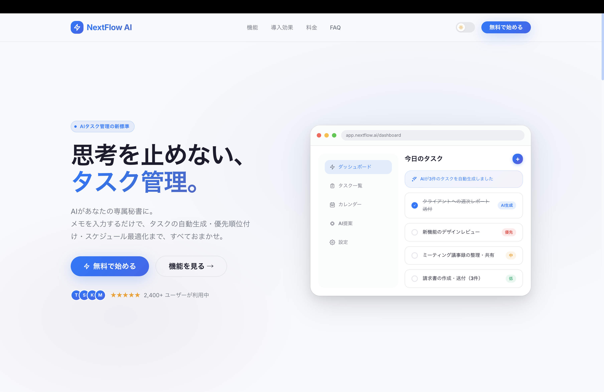
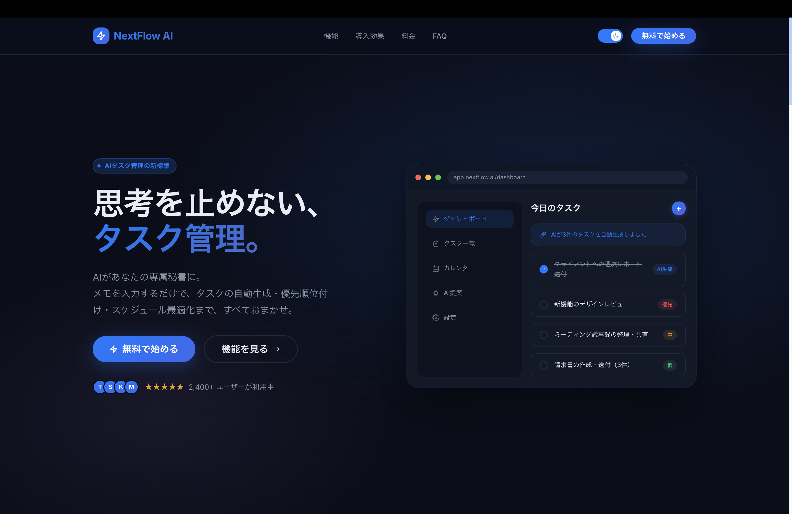

# NextFlow AI — 架空のタスク管理AIアプリの紹介LP

架空のタスク管理AI『NextFlow AI』の紹介ランディングページ。クリーン・ミニマルなデザインと、ダークモード・スクロールアニメーション・料金トグルなどのインタラクションを実装しました。




## 確認方法

リポジトリをクローン後、`index.html` をブラウザで開くだけで動作します。ビルド作業は不要です。

```bash
git clone <repository-url>
# index.html をブラウザで開く
```

## 技術スタック

| 領域         | 使用技術                              |
| ------------ | ------------------------------------- |
| マークアップ | HTML5 (セマンティック)                |
| スタイリング | Sass/SCSS (`@use` モジュールシステム) |
| スクリプト   | Vanilla JavaScript (ES5 IIFE)         |
| アイコン     | カスタム SVG (手書きパス)             |
| ビルド       | npm scripts + Dart Sass               |

## 機能一覧

### UI / デザイン

- **ダークモード** — トグルスイッチで切替、`localStorage` に保存、`prefers-color-scheme` を初期値として参照
- **ブラウザウィンドウモック** — ヒーローセクションに macOS 風のアプリ画面モックアップを配置。`pointer-events: none` で非インタラクティブ化
- **グラスモーフィズムナビ** — スクロールで `backdrop-filter: blur(16px)` が有効化
- **グラデーションボタン** — `background-position` シフトによるホバーアニメーション

### インタラクション

- **スクロールアニメーション** — `IntersectionObserver` で要素の fadeIn / slide-in を制御（一度だけ発火）
- **料金トグル** — 月払い/年払いを切替。価格数値を opacity + translateY のフリップアニメーションで更新
- **水平バーチャート** — 導入前後の工数比較グラフ。スクロール進入時にバーが伸びるアニメーション
- **FAQ アコーディオン** — クリック & キーボード操作対応、`aria-expanded` による ARIA サポート
- **カウンターアニメーション** — 数値が ease-out で跳ね上がるカウントアップ演出

### レスポンシブ

- ブレークポイント: `sm (640px)` / `md (768px)` / `lg (1024px)` / `xl (1280px)`
- ヒーローは 2カラム → 1カラム、サイドバーは `lg` 以下で非表示

## SCSS 構成

```
scss/
├── style.scss          # エントリーポイント (@forward で全パーシャルをまとめる)
├── _variables.scss     # デザイントークン (色・タイポ・スペーシング・シャドウ)
├── _mixins.scss        # mq() / container / btn-base / gradient-text / reveal-*
├── _base.scss          # リセット・タイポグラフィ・セクション共通
├── _animations.scss    # @keyframes (fadeInUp / fadeInRight / pulse / gradientShift)
├── _nav.scss
├── _hero.scss          # ブラウザモック・アプリUI モックを含む
├── _features.scss
├── _efficiency.scss    # 水平バーチャート
├── _pricing.scss       # 縦並びトグル・プランカード
├── _faq.scss
└── _footer.scss
```

## カスタム SVG アイコン

`img/` フォルダに手書きパスで作成したオリジナルアイコンを格納。

| ファイル                         | 説明                                                    |
| -------------------------------- | ------------------------------------------------------- |
| `icon-wand.svg`                  | 4点星 + 魔法の杖 (AI提案機能)                           |
| `icon-schedule.svg`              | カレンダー + 更新矢印 + タスクバー (スケジュール最適化) |
| `icon-bell.svg`                  | ベル + 通知ドット (リマインダー)                        |
| `icon-brain.svg`                 | 脳 (AI機能)                                             |
| `icon-bolt.svg` / `icon-zap.svg` | 高速処理                                                |
| `icon-sun.svg` / `icon-moon.svg` | ダークモード切替                                        |

## 開発環境（SCSS を編集する場合）

```bash
# 依存パッケージのインストール
npm install

# SCSS をウォッチしながらコンパイル
npm run dev

# 本番用に圧縮コンパイル
npm run sass
```

## ディレクトリ構成

```
next-flow/
├── index.html
├── css/
│   └── style.css          # コンパイル済み (コミット対象)
├── scss/                  # ソース
├── js/
│   └── main.js
├── img/                   # SVG アイコン
└── package.json
```

## デザイン方針

- フォント: **Inter** (英数) + **Noto Sans JP** (日本語)
- プライマリカラー: `#007AFF` (Blue)
- アクセント: `#7B5EA7` (Purple) / `#0AB5A8` (Teal)
- 背景: `#F8F9FA` (Light) / `#0D1525` (Dark)
